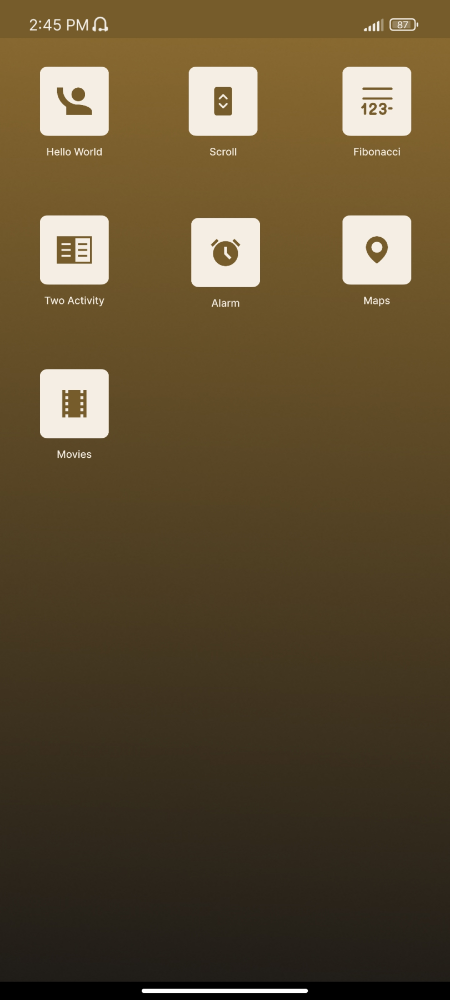

## UAS Pemograman Mobile

<table>
  <tr>
    <td>Nama</td>
    <td>Rafif Isdarufa Athallah</td>
  </tr>
  <tr>
    <td>NIM</td>
    <td>312210299</td>
  </tr>
  <tr>
    <td>Kelas</td>
    <td>TI.22.A3</td>
  </tr>
</table>

---

### Pdf

> Click Here

---

### Aplikasi

Konten Dalam Aplikasi:

- Launcher Logo
- Halaman Utama
- Hello World
- Scroll
- Fibonacci
- Two Activity
- Alarm
- Maps
- Movies

---

### Launcher Logo

Bagian ini dibuat menggunakan `activity_splash.xml` untuk layoutnya, dan `SplashActivity.java` untuk menampilkannya pada saat aplikasi dibuka, kemudian akan mengarahkan ke halaman utama aplikasi setelah 5 detik.

---

### Halaman Utama

Bagian ini dibuat menggunakan `activity_main.xml` untuk layoutnya, dan `MainActivity.java` untuk membuat fungsi membuka *activity* lain, ketika mengklik *icon* menunya.

---

