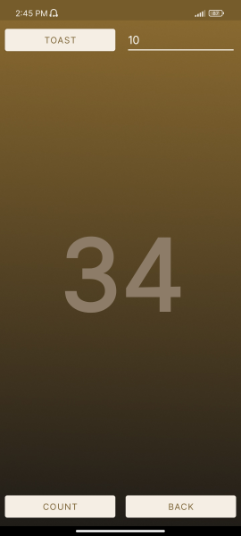

## UAS Pemograman Mobile

<table>
  <tr>
    <td>Nama</td>
    <td>Rafif Isdarufa Athallah</td>
  </tr>
  <tr>
    <td>NIM</td>
    <td>312210299</td>
  </tr>
  <tr>
    <td>Kelas</td>
    <td>TI.22.A3</td>
  </tr>
</table>

---

### Pdf

> 

---

### Aplikasi

Konten Dalam Aplikasi:

- Launcher Logo
- Halaman Utama
- Hello World
- Scroll
- Fibonacci
- Two Activity
- Alarm
- Maps
- Movies

---

### Launcher Logo

Bagian ini dibuat menggunakan `activity_splash.xml` untuk *layout*-nya, dan `SplashActivity.java` untuk menampilkannya pada saat aplikasi dibuka, kemudian akan mengarahkan ke halaman utama aplikasi setelah 5 detik.

---

### Halaman Utama

Bagian ini dibuat menggunakan `activity_main.xml` untuk *layout*-nya, dan `MainActivity.java` untuk membuat fungsi membuka *activity* lain, ketika mengklik *icon* menunya.

---

### Hello World

Bagian ini dibuat menggunakan `activity_hello.xml` untuk *layout*-nya, dan `MainHello.java` untuk menampilkan halamannya.

---

### Scroll

Bagian ini dibuat menggunakan `activity_sianida.xml` untuk *layout*-nya dengan `<ScrollView></ScrollView>` agar dapat di-`scroll` ke bawah, dan `MainSianida.java` untuk menampilkan halamannya.

---

### Fibonacci

Bagian ini dibuat menggunakan `activity_toast.xml` untuk *layout*-nya, dan `MainToast.java` untuk fungsi menghitung bilangan *fibonacci* sampai dengan nilai maksimum yang di-*input*.

---

### Two Activity

Bagian ini dibuat menggunakan `activity_satu.xml` dan `activity_dua.xml` untuk *layout*-nya, dan `MainFirstActivity.java` serta `MainSecondActivity.java` untuk membuat fungsi mengirim pesan dari *activity* satu ke *activity* dua, begitu juga sebaliknya.

---

### Alarm

Bagian ini dibuat menggunakan `MainActivity.java` untuk membuat fungsi `createAlarm()` yang akan membuka alarm pada smartphone.

---

### Maps

Bagian ini dibuat menggunakan `MainActivity.java` untuk membuat fungsi `showMap()` yang akan membuka aplikasi *maps* pada smartphone.

---

### Fragment

Bagian ini dibuat menggunakan `activity_fragment.xml` untuk tab *fragment*-nya, lalu `fragment_satu.xml`, `fragment_dua.xml`, dan `fragment_tiga.xml` untuk *layout* halamannya serta poster *movie*-nya. Lalu `activity_video.xml` untuk *layout* videonya.

`FirstFragment.java`, `SecondFragment.java`, dan `ThirdFragment.java` untuk berpindah antar *fragment*-nya, serta terdapat fungsi `playVideo()` untuk menampilkan video berdasarkan *ID* gambar yang di-klik, lalu `VideoActivity.java` untuk menjalankan videonya.

.png)

.png)

---

  <h3>Sekian, terimakasih.</h3>

